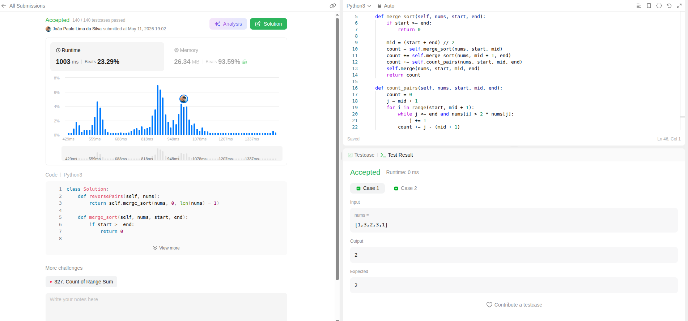
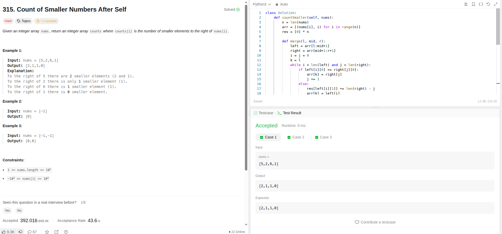
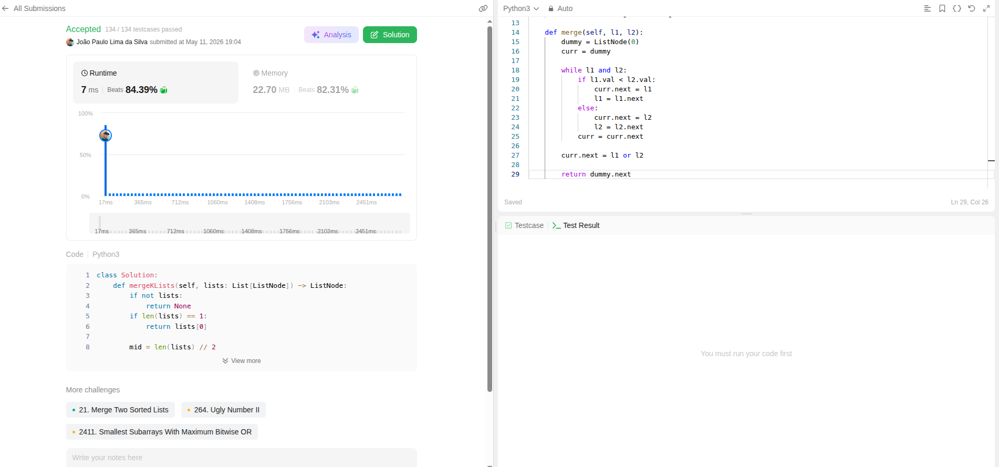
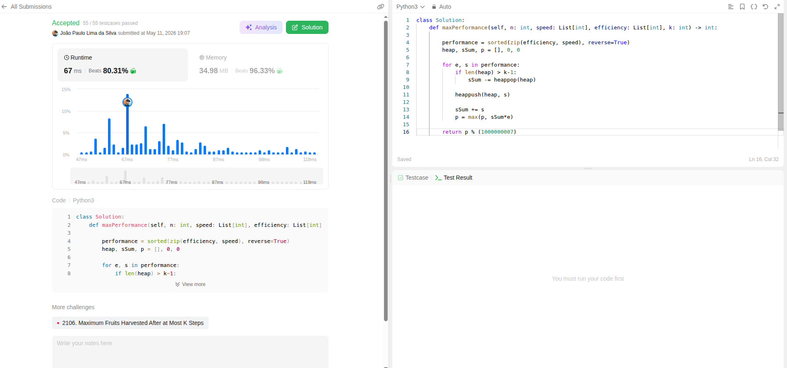

# Algoritmos_Ordenacao_LeetCode

**Número da Lista:** 43  
**Conteúdo da Disciplina:** Algoritmos de Ordenacao

---

## Alunos

| Matrícula  | Aluno                    |
| ---------- | ------------------------ |
| 19/0030755 | João Paulo Lima da Silva |

---

## Sobre

Este projeto tem como propósito a resolução de exercícios da plataforma LeetCode. A iniciativa busca consolidar, por meio da prática, os conceitos teóricos estudados em sala de aula, promovendo o desenvolvimento do raciocínio lógico e da capacidade de resolução de problemas complexos.

---

## Descrição e Screenshots

## [493. Reverse Pairs DIFÍCIL](https://leetcode.com/problems/reverse-pairs/description/)

#### [Link do Código](leetcode/493.py)

## [315. Count of Smaller Numbers After Self DIFÍCIL](https://leetcode.com/problems/count-of-smaller-numbers-after-self/description)

#### [Link do Código](leetcode/315.py)

## [23. Merge k Sorted Lists](https://leetcode.com/problems/merge-k-sorted-lists/description/)

#### [Link do Código](leetcode/668.Kth-Smallest-Number-in-Multiplication-Table.py)

## [1383. Maximum Performance of a Team DIFÍCIL](https://leetcode.com/problems/maximum-performance-of-a-team/description/)

#### [Link do Código](leetcode/1383.py)

---

## Instalação

- **Linguagem:** python
- **Framework:** (caso exista)

---

## Uso

Acesse a plataforma LeetCode, pesquise o número do exercicio, insira o código na área de edição do código e clique em "Run" para executá-lo.

---

## Link da Apresentação

[Link](https://youtu.be/f-s0QcqFQVU)
